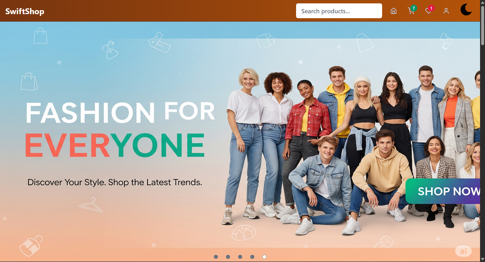
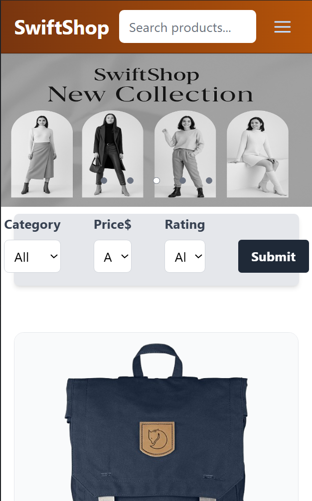
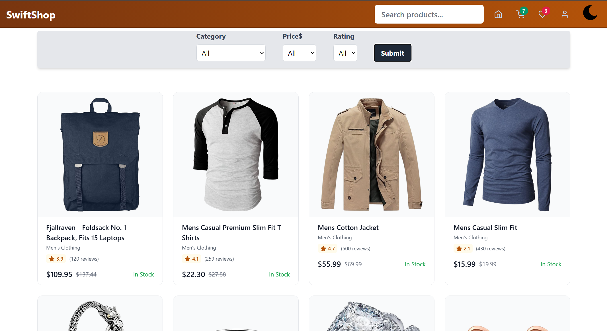
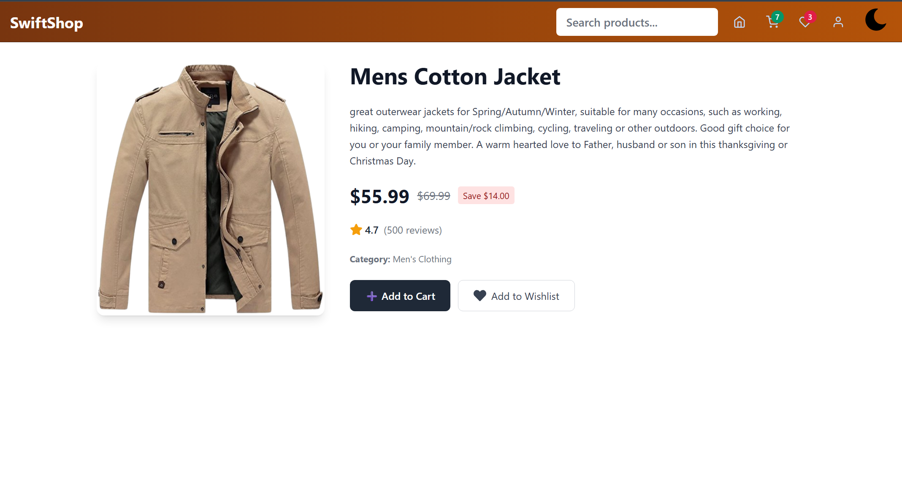
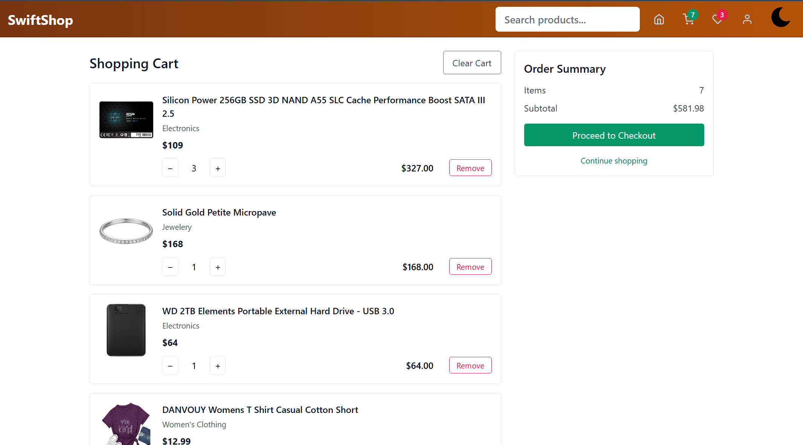
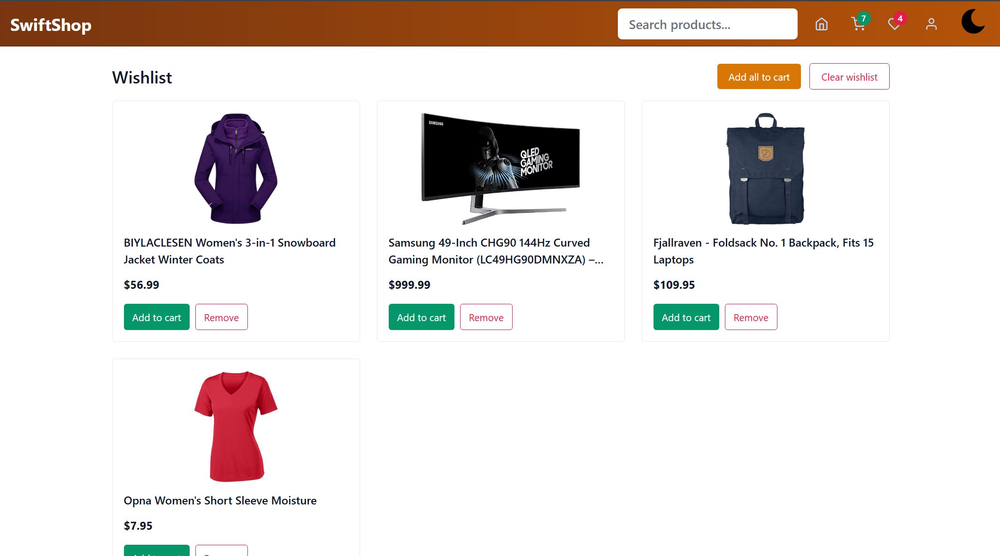
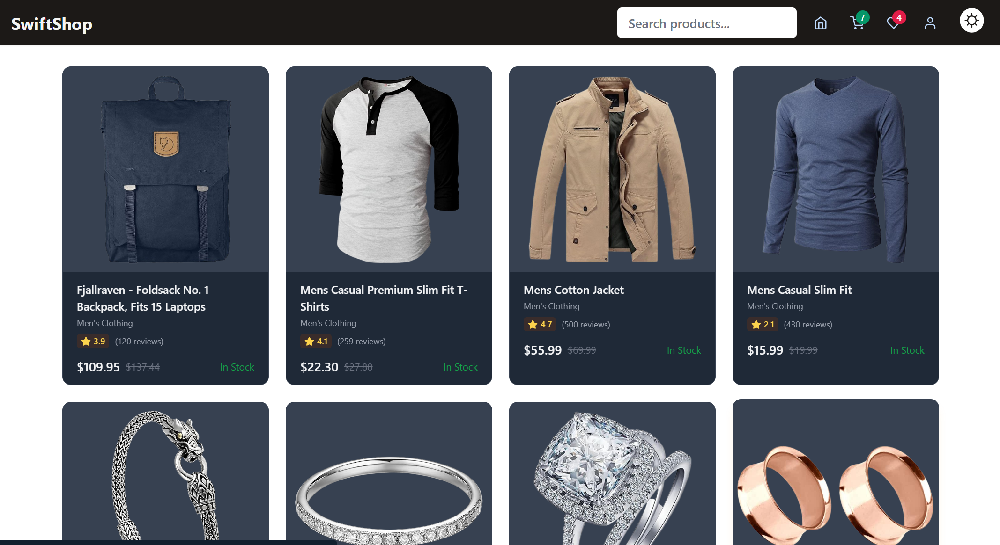

# 🛒 SwiftShop
### *Modern E-commerce Platform Built with React*

<div align="center">


**🌟 A feature-rich, responsive e-commerce platform showcasing modern web development**

[🚀 Live Demo](#-live-demo) • [📖 Features](#-key-features) • [⚡ Quick Start](#-quick-start) • [🛠️ Tech Stack](#-tech-stack)

</div>

---

## 📸 Screenshots

<div align="center">

### 🏠 **Home Page**

*Modern landing page with featured products and smooth navigation*

### 📱 **Responsive Design**
<table>
<tr>
<td width="50%">

<p align="center"><em>Desktop Experience</em></p>
</td>
<td width="50%">

<p align="center"><em>Mobile Experience</em></p>
</td>
</tr>
</table>

### 🛍️ **Product Features**
<table>
<tr>
<td width="33%">

<p align="center"><strong>Product Catalog</strong></p>
</td>
<td width="33%">

<p align="center"><strong>Product Details</strong></p>
</td>
<td width="33%">

<p align="center"><strong>Shopping Cart</strong></p>
</td>
</tr>
</table>

### 🎨 **Theme & User Experience**
<table>
<tr>
<td width="50%">

<p align="center"><em>Wishlist Management</em></p>
</td>
<td width="50%">

<p align="center"><em>Dark Mode Theme</em></p>
</td>
</tr>
</table>

### 🔐 **Authentication**

*Secure user authentication with form validation*

</div>

## 📖 About SwiftShop

SwiftShop is a comprehensive e-commerce platform built as a **Full Stack Web Development Capstone Project**. It demonstrates modern React patterns, state management with Redux, responsive design principles, and industry-standard development practices.

> **Built from scratch** to provide users with an intuitive and seamless online shopping experience across all devices.

---

## ✨ Key Features

<table>
<tr>
<td width="50%">

### 🏪 **E-commerce Core**
- 🛍️ **Product Browsing** - Category filtering & search
- 🛒 **Shopping Cart** - Add, remove, quantity management  
- ❤️ **Wishlist** - Save favorites for later
- 📱 **Product Details** - Comprehensive product info
- 🔐 **User Authentication** - Secure login system

</td>
<td width="50%">

### 💎 **Modern Features**
- 🎨 **Dark/Light Theme** - Toggle between modes
- 📱 **Fully Responsive** - Perfect on all devices
- ⚡ **Fast Loading** - Shimmer UI & optimized performance
- 🔍 **Smart Search** - Real-time product filtering
- 🧭 **Smooth Navigation** - Hash-based section linking

</td>
</tr>
</table>

---

## 🚀 Live Demo

<div align="center">

### 🌐 **[Visit SwiftShop Live](https://your-deployment-url.vercel.app)**

</div>

### 🔐 **Demo Credentials**
```
Username: mor_2314
Password: 83r5^_
```
> 💡 *Use these test credentials to explore all features, or create your own account*

---

## 🛠️ Tech Stack

<div align="center">

| Category | Technologies |
|----------|-------------|
| **Frontend** | React 18, React Router 6, Redux Toolkit |
| **Styling** | Tailwind CSS, CSS3, Responsive Design |
| **Forms** | Formik, Yup Validation |
| **Build Tools** | Vite, ESLint, PostCSS |
| **Testing** | Vitest, React Testing Library |
| **API** | Fake Store API, Fetch API |

</div>

---

## ⚡ Quick Start

### 📋 **Prerequisites**
```bash
Node.js >= 16.0.0
npm >= 8.0.0
Git
```

### 🚀 **Installation**

```bash
# 1️⃣ Clone the repository
git clone https://github.com/mohitshivv/ecommerceOne.git
cd ecommerceOne

# 2️⃣ Install dependencies  
npm install

# 3️⃣ Create environment file
touch .env
```

### 🔧 **Environment Setup**
Add to your `.env` file:
```env
VITE_API_URL=https://fakestoreapi.com
VITE_APP_NAME=SwiftShop
VITE_APP_VERSION=1.0.0
```

### 🎯 **Run the Application**
```bash
# Start development server
npm run dev

# Open browser at
http://localhost:5173
```

---

## 📁 Project Architecture

```
📦 SwiftShop/
├── 🌍 public/
│   └── images/banners/          # Static assets & banners
├── 📱 src/
│   ├── components/              # React components
│   │   ├── tests/              # Component unit tests
│   │   ├── Header.jsx          # Navigation & branding
│   │   ├── Home.jsx            # Landing page
│   │   ├── Cart.jsx            # Shopping cart
│   │   ├── ProductDetails.jsx  # Product information
│   │   ├── Login.jsx           # User authentication
│   │   └── WishList.jsx        # Favorite products
│   ├── 🛒 checkout/            # Checkout flow
│   │   ├── AddressForm.jsx     # Shipping details
│   │   ├── PaymentForm.jsx     # Payment processing
│   │   └── OrderSuccess.jsx    # Order confirmation
│   ├── 🎨 context/             # React Context
│   │   ├── ThemeContext.jsx    # Dark/Light themes
│   │   └── UserContext.jsx     # User state
│   ├── 🗄️ redux/               # State management
│   │   ├── Store.js            # Redux store
│   │   ├── cartSlice.js        # Cart state
│   │   ├── authSlice.js        # Authentication
│   │   └── productsSlice.js    # Product data
│   ├── ✨ shimmerUI/           # Loading skeletons
│   └── 🔧 customHooks/         # Custom React hooks
├── 📄 Configuration Files
├── 🧪 Testing Setup
└── 📚 Documentation
```

---

## 🧪 Testing

<div align="center">

| Command | Description |
|---------|-------------|
| `npm run test` | Run all tests |
| `npm run test:watch` | Watch mode |
| `npm run coverage` | Coverage report |

</div>

### ✅ **Current Test Coverage**
- Component rendering tests
- User interaction flows  
- Cart & Wishlist functionality
- Form validation testing
- Route navigation tests

---

## 🚀 Deployment

### **Vercel (Recommended)**
```bash
npm run build
vercel --prod
```

### **Netlify**
```bash
# Build command: npm run build
# Publish directory: dist
```

### **Manual Deployment**
```bash
npm run build    # Creates dist/ folder
# Upload dist/ to your hosting provider
```

---

## 🗺️ Development Roadmap

<div align="center">

| Status | Feature | Description |
|--------|---------|-------------|
| ✅ | **Core E-commerce** | Products, cart, wishlist |
| ✅ | **Authentication** | User login/logout system |
| ✅ | **Responsive UI** | Mobile-first design |
| ✅ | **Theme Toggle** | Dark/light mode |
| ✅ | **Testing Setup** | Unit tests framework |
| 🔄 | **Order History** | User purchase tracking |
| 📋 | **Payment Gateway** | Secure payment processing |
| 📋 | **Product Reviews** | User ratings & feedback |
| 📋 | **Admin Panel** | Product management |
| 📋 | **Email Notifications** | Order confirmations |

</div>

---

## 🎯 Performance & Features

<div align="center">

### **🏆 Project Highlights**

| Aspect | Implementation |
|--------|---------------|
| **Modern React** | Functional components, hooks, context |
| **State Management** | Redux Toolkit with efficient slices |
| **Responsive Design** | Mobile-first Tailwind CSS approach |
| **User Experience** | Smooth animations & loading states |
| **Code Quality** | ESLint, proper folder structure |
| **Testing** | React Testing Library integration |

</div>

---

## 🔧 Available Scripts

<div align="center">

| Script | Command | Description |
|--------|---------|-------------|
| **Development** | `npm run dev` | Start dev server |
| **Production** | `npm run build` | Create production build |
| **Preview** | `npm run preview` | Preview production build |
| **Testing** | `npm run test` | Run test suite |
| **Linting** | `npm run lint` | Check code quality |

</div>

---

## 🐛 Known Issues & Solutions

<div align="center">

| Issue | Status | Solution |
|-------|---------|----------|
| **Large Product Lists** | 🔄 Optimizing | Adding pagination & virtualization |
| **Mobile Checkout** | 🔄 Refining | Improving spacing on small screens |
| **Search Performance** | 📋 Planned | Implementing debounced search |

</div>

---

## 🤝 Contributing

<div align="center">

**Interested in contributing? Follow these steps:**

</div>

```bash
# 1️⃣ Fork the repository
# 2️⃣ Create your feature branch
git checkout -b feature/amazing-feature

# 3️⃣ Commit your changes
git commit -m 'Add some amazing feature'

# 4️⃣ Push to the branch
git push origin feature/amazing-feature

# 5️⃣ Open a Pull Request
```

---

## 📞 Contact & Support

<div align="center">

### **👨‍💻 Mohit Shiv**
*Full Stack Developer & Project Creator*

[](https://github.com/mohitshivv)
[](mailto:mohitshiv995@gmail.com)

**📧 Email:** mohitshiv995@gmail.com  
**🐙 GitHub:** [@mohitshivv](https://github.com/mohitshivv)

</div>

---

## 📄 License

<div align="center">

This project is licensed under the **MIT License** - see the [LICENSE](LICENSE) file for details.

</div>

---

## 🙏 Acknowledgments

<div align="center">

**Special thanks to:**

🌟 [**Fake Store API**](https://fakestoreapi.com/) - For providing comprehensive product data  
🎨 [**Tailwind CSS**](https://tailwindcss.com/) - For the amazing utility-first framework  
🎯 [**React Icons**](https://react-icons.github.io/) - For beautiful, consistent iconography  
🚀 **Open Source Community** - For continuous inspiration and learning  

</div>

---

<div align="center">

### 🌟 **Built with ❤️ for modern web development**

**⭐ Star this repository if you found it helpful!**

*SwiftShop - Making online shopping swift and smart* 🛍️

</div>